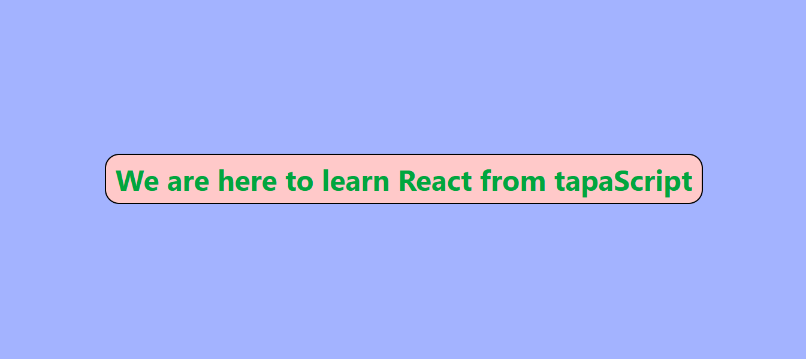

# React[V6.1.0] Project with Vite[V6.1.0] and Tailwind CSS[v4.0]

This React project was set up with Vite, styled with Tailwind CSS, and then put live on Netlify.

## Features

- 🚀 **Vite**: Super-fast build tool for modern web projects.
- 🎨 **Tailwind CSS**: Utility-first CSS framework for styling.
- 🌐 **Netlify or Vercel Deployment**: Seamless deployment and hosting.

---

## Getting Started

### Prerequisites

Ensure you have the following installed:

- [Node.js](https://nodejs.org/) (v14 or higher)
- [npm](https://www.npmjs.com/) or [yarn](https://yarnpkg.com/)

### Installation

1. **Clone the repository**

   ```bash
   git clone <repository-url>
   cd <project-name>

2. **Install dependencies:**

   ```bash
    npm install
    # or
    yarn install
   ```
3. **Start the development server:**

   ```bash
    npm run dev
    # or
    yarn dev
   ```
### Project Live  and Demo
[Click Here](https://react-task-1-cyan.vercel.app/)




### License

This project is licensed under the MIT License.

### Contact

If you have any questions or need further clarification, please contact my Email / Linkedin .

- **💌 Email : pranto113015@gmail.com**

- **🕵️‍♂️ Linkedin : [Pranto Kumar](https://www.linkedin.com/in/pranto-kumar-a326801b3/)**

Thank you for reviewing my project 💙